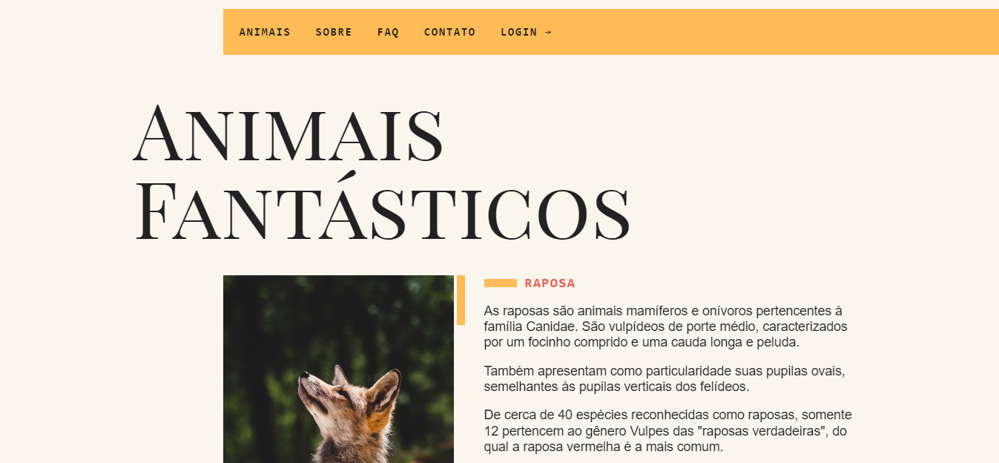

# animais-fantasticos
O projeto ainda não está concluído

Link da página: <https://ronaldof16.github.io/animais-fantasticos/>

## Sobre

Esse projeto foi desenvolvido durante o curso de JavaScript da Origamid Cursos, tratá-se de um site com várias funcinalidades. No menu, ao clicar nos links animais, 
faq e contato irá ocorrer um evento de scroll suave onde irá até o link interno na página, ao clicar ou passar o mouse sobre o link "sobre" irá aparecer um submenu 
com outros links e ao clicar no link login irá aprecer um modal para o usuário fazer o login, e para tela menores foi criado um menu mobile que irá aparecer em telas 
abaixo de 700px. Abaixo do menu temos uma galeria com uma lista de imagens com um scroll para se mover entre eles,  que ao clicar em cada animal irá aparecer um texto 
com informações referentes ao animal selecionado. Na sequência temos a seção de contatos com informaçõs e um mapa, quando o usuário mover o mouse sobre o mapa irá 
aparecer uma caixa de texto com informações sobre o endereço que irá seguir o movimento do mouse enqunto ele estiver sobre o mapa.

## Objetivo

O objetivo desse projeto foi colocar em prática todo o conteúdo estudado durante o curso, nele foi possível trabalhar com funções simples e arrow functions, 
deu pra utilizar diversos métodos de JavaScript, foram criados vários eventos de click e scroll no projeto, foi utilizado o JavaScript com módulos para organizar 
melhor os códigos. 

## Competências Utilizadas

* HTML
* CSS
* JAVASCRIPT
